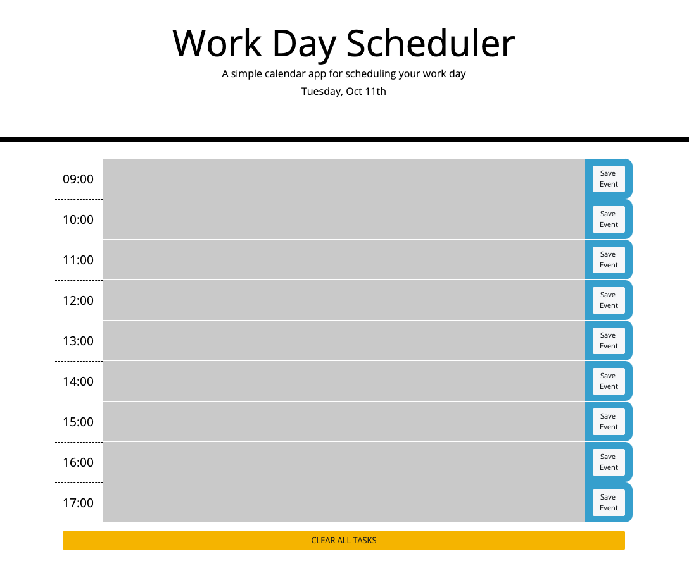

# WORK DAY PLANNER

## Description

This simple yet effective day planner is a great way to organize the important aspects of your day.  With a quick glance the user can see the current hour and how much of their day is left.  Although working with Bootstrap to build out the styling made things easy, trying to work with time, variables, arrays and jQuery together proved a unique challenge.  This project was a great exercise in id and class tags as well as reinforcing jQuery skills.

While the application is fully functional, the code appears redundant in places and lends itself to refactoring in the future for simplification.

## Installation

Installation is easy!  Simply copy and paste the following URL into your favorite browser:

https://argounova.github.io/day-planner/

## Usage

Click into the center section and input text.  Click "Save Event" to the right.  If the entire day needs to be cleared or reset, simply click "Clear All Tasks" towards the bottom of the page.

## Credits

## License

N/A - Open Source